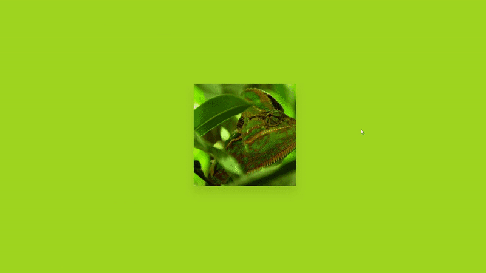

<h1 align="center">Flip images</h1>

## Sobre o projeto 🔎:

É um projeto básico para exercitar meu CSS. As imagens viram como se estivesse passando uma página e o background altera conforme elas transitam.

## Layout final do projeto 🖼️:

## Linguagens utilizadas 🛠️:

    
          

## Autor 👨‍🎨:
Ricardo Lima | Aspirante a front-end developer

     
     

